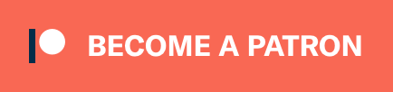

 

# PreMiD

## Your Rich Presence for web services!

 

# About

**PreMiD** is a simple, configurable utility that allows you to show what you're doing on the web in your Discord **now playing status**. It supports many different websites, and will support multiple users watching the same content simultaneously in an upcoming update.

# Features

· Displays your current web service in Discord as your status. 
· Grants full control over Presences. 
· Supports over 100 web services, still rising! 
· _Watch parties and more are coming soon!_

# Installation/Troubleshooting

### Installation instructions, Troubleshooting guides etc. can be found in our [**Wiki**](https://wiki.premid.app).

# Support us

  

    
    
  

## License
