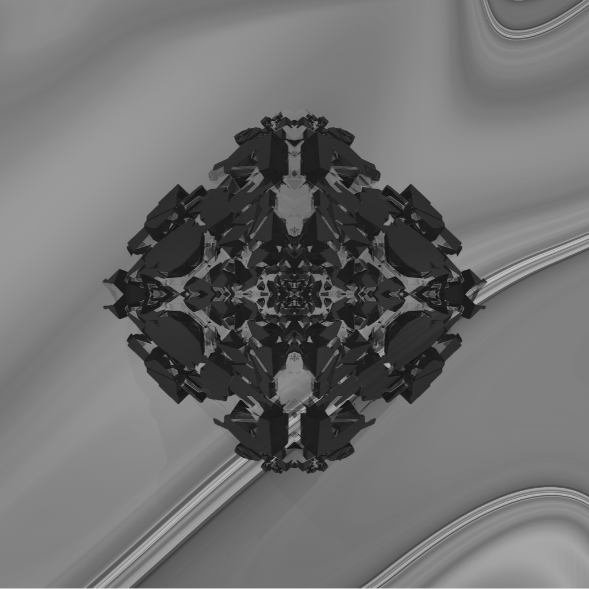
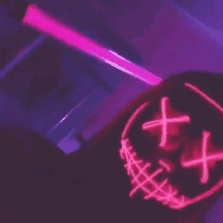

##  

# <b> </b>PreMiD &middot; Media Rich Presence for Discord
&nbsp;
&nbsp;

# About
## Summary

**PreMiD** is a simple, configurable utility to allow you to show what you're watching in your Discord **now playing status**. It supports [many different platforms](#support), and will also support multiple users watching the same content simultaneously in an upcoming update.

## Features

- Integrates with Discord's official Rich Presence API library.
- Supports your keyboard's **Media Control** function keys.
- Automatically clears your current presence after 1 minute of inactivity.
- Supports **YouTube, YouTube Music, Netflix, SoundCloud** and many more to come.
- _Watch parties and more are coming soon!_

# Table of contents
- [About](#about)
  - [Summary](#summary)
  - [Features](#features)
- [Support](#support)
- [Installation](#installation)
  - [Installing the Extension](#extension)
    - Chrome
    - Opera
  - [Installing the Application](#application)
    - Mac OS
    - Windows
- [Donator] (#donator)
- [Team] (#team)

# Support

### **Operating Systems**

- Windows
- Mac OS

### **Browsers**

- Chrome
- Opera

# Installation

## Extension

  
<b><u>Installing the Chrome extension</u></b> (Click to expand)

  <h1>Chrome Extension Installation</h1>
  <ol>
    <li>Click <a href="https://chrome.google.com/webstore/detail/yt-presence/agjnjboanicjcpenljmaaigopkgdnihi">this</a> link</li>
    </li>
    <li>Click "add to Chrome"</li>
    <li>Install the <a href="#application">application</a></li>
  </ol>

<b><u>Installing the Opera extension</u></b> (Click to expand)

  <h1>Opera Extension Installation</h1>
  <ol>
    <li>Download the latest version of the <a href="https://github.com/Timeraa/YT-Presence/releases/latest">extension</a>
    </li>
    <li>Extract the downloaded <b>.zip</b> file</li>
    <li>Open Opera</li>
    <li>Go to <a href="chrome://extensions/">chrome://extensions/</a></li>
    <li>Drag and drop the Folder <b>"Extension"</b> on the page 
    <li>Install the <a href="#application">application</a></li>
  </ol>

## Application

  
<b><u>Mac OS</u></b> (Click to expand)

  <h1>Installation on Mac OS</h1>
  <ol>
    <li>Download the latest version of the <a href="https://github.com/Timeraa/YT-Presence/releases/latest">application</a>
    </li>
    <li>Open the downloaded <b>.dmg</b> file</li>
    <li>Drag <b>PreMiD</b> Into your <b>Applications</b> Folder</li>
    <li>Open your Launchpad or press F4</li>
    <li>Open <b>PreMiD</b></li>
    <li>Press <b>"Allow"</b> if a window pops up</li>
    <li>Install extension if not already</li>
  </ol>

  
<b><u>Windows</u></b> (Click to expand)

  <h1>Installation on Windows</h1>
  <ol>
    <li>Download the latest installer from <a href="https://github.com/Timeraa/YT-Presence/releases/">here</a></li>
    <li>Open the downloaded <b>.exe</b> installer</li>
    <li>If SmartScreen comes up press more informations then press run anyways. (It's not a virus, I promise.)</li>
    <li>YouTube Presence should install itself and start automatically. (You can tell by looking at the taskbar.)</li>
    <li>Install the extension, if you haven't already.</li>
  </ol>

---

# Donator
## Patrons

<b>TOP DONATOR</b>

<i>My first Patron :3</i>

## PayPal

<i>My first Donation :3</i>

# Team

## Founder and Developer

## Admin and Translation Manager

## Translator

### Arabic

### German

### Hebrew

### Japanese

### Korean

### Latin

### Swedish

---

### PreMiD - (Rich) Presence for Media in Discord | by Timeraa
