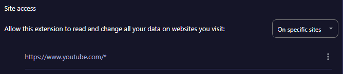
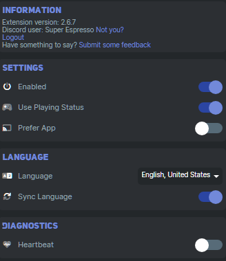

# General Troubleshooting

## PreMiD Troubleshooting Post-Installation

### Prerequisites

- The Extension should be installled at this point.
- You should confirm you are logged into Discord via the extension.
- You should have Activity Privacy > Detected Activities turned on in your Discord settings.

***If you are looking for the app/application to use with the extension, it no-longer exists and all instructions with it should be ignored.***

## Steps For Resolving Most Issues

### Part 1: Resetting PreMiD to Discord Hooks
- Close your web-browser fully.
- Open your web-browser again.
- Navigate to PreMiD extension, make sure you're logged in with Discord (Your icon should appear in the top right of the extension) 
- Select your user-icon in the top-right corner of the extension. 
- Select "Logout" to log out of Discord from the PreMiD extension.
- Log back in to Discord from the PreMiD extension. 
- Close and reopen your web browser again.
- Under Discord settings, navigate to **Activity Settings** > **Activity Privacy** > **Share your detected activities with others.** and ensure this setting is *on*.
- Ensure you have **no** other games or programs running that will take priority.
- Navigate to a presence-enabled site or [Click Here](https://www.youtube.com/watch?v=jNQXAC9IVRw) to test your PreMiD with Youtube. 

### **Part 2: Presence Fixing**
- Turn on your presence and ensure privacy mode is **off**
- Right-click the extension in your **browser** and go to "Manage" 
- Check under "Site access" and make sure the correct pages are enabled.

  - You can do this with "Allow this extension to read and change all your data on websites you visit" "On click"  
 - Once you go to those pages, *click* the extension to ensure it's active for those sites. Re-load any pages after!
- Go to Settings for the plugin, click your icon and make sure "Enabled" is on
  - You can turn enabled off and on to kick it online, and press "Use Playing Status". 
  - Sometimes just turning "Use Playing Status" off and on will kickstart it after loading Discord.
- In your *web browser, fully reload all pages using PreMiD or restart the browser* 
  - Most problems can be fixed by relaunching either a web browser or Discord!
- Finally, you should see your activity. 
- If this doesn't work, flick off and on "Playing Status" and it should kick online.

### **Part 3: Kickstarts**
If **all of the above steps were followed in order:**

- Turn Privacy mode On and Off. If using Youtube there may be an icon in the bottom of a video with a slash through an eye. Click this! Give it a moment to load and check your Discord Status. 
- Turn "Enabled" off and on 

- Check the store page for your extension, as sometimes it only activates from certain web URLS.
  - *EG: Soundcloud will only work if the page listed in the presence store is from "Soundcloud.com" You cannot use other hosts!*
- Fully check your Web Extension > Manage page and ensure it is set up to work.
  - *EG: "Allow this extension to read and change all your data on websites you visit > On Specific Sites" "https://www.youtube.com/**
  - *Note*: An "*"/Asterisk is a wildcard value, meaning any page from that host can be accessed. 
- After any changes are made, it's always a good idea to close your web browser and Discord to reload.
